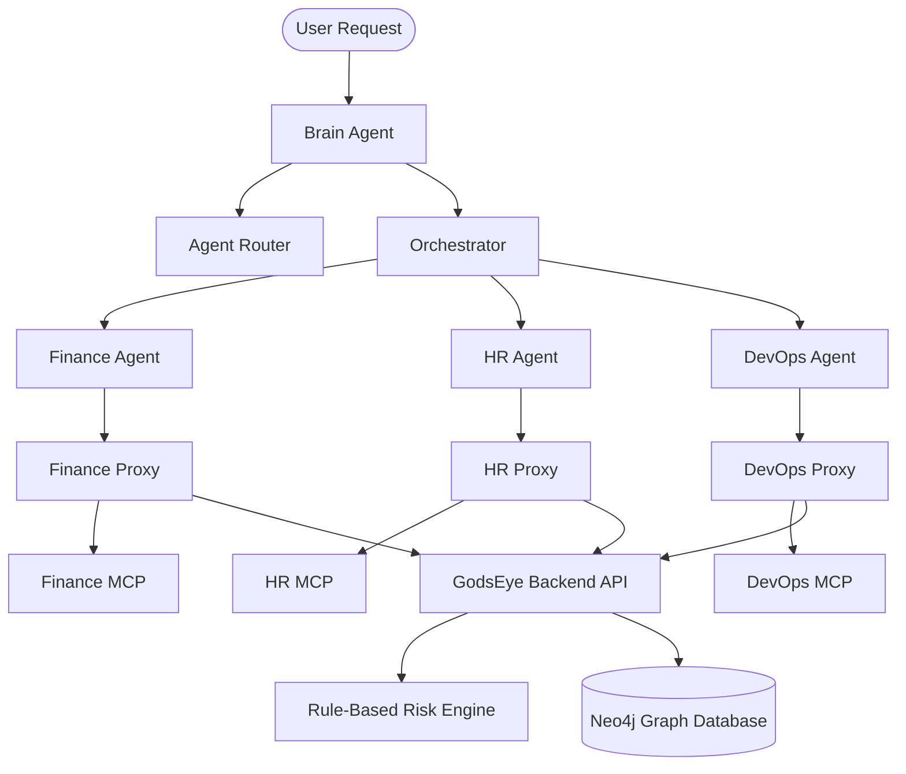

# GodsEye Architecture

GodsEye is designed around a three-tier architecture to discover, govern, and audit AI ecosystems.

## 1. Transparent Passive Proxy Layer
- **MCP Proxy Wrapper (`scripts/mcp_proxy.py`)**: Sits transparently between sub-agents and their configured MCP servers. Pipes stdin/stdout streams bidirectionally, parsing JSON-RPC messages passively to capture tool calls and initialization contexts without modifying agent execution behavior.
- **Asynchronous Reporter**: Delivers events to the backend REST endpoint (`/events/`) in a background daemon thread, keeping the agent-server critical execution pipeline non-blocking and real-time.

## 2. Agent Orchestration Layer
- **Brain Agent**: Acts as the router and supervisor. It classifies user requests using the `AgentRouter` and triggers specialized sub-agents.
- **Sub-agents**: Connect to target MCP servers via proxy wrapper execution.

## 3. Model Context Protocol (MCP) Governance
- **Governance Metadata Tool**: Each server exposes `get_governance_metadata()`. This endpoint acts as an active compliance certificate.
- **Scanner Service**: The scanner connects to MCP server instances and calls `get_governance_metadata()` to discover its:
  - Security parameters (Authentication status & type, Network reachability, TLS status, Audit log configuration).
  - Exposed capabilities (Tool categories, individual tool risks, exposed resource URIs, and templates).
- **Workspace Auto-Discovery Bootstrap**: Endpoint `/discovery/bootstrap` automatically scans all agents, resolving server paths, scanning tools, evaluating risks, and instantiating the baseline compliance topology graph.

## 4. Security Compliance & Risk Engine
- **Policy Checks**:
  - **Authentication Rule**: Inspects whether the server enforces credentials.
  - **Network Boundary Rule**: Inspects public internet exposure and transport security (TLS).
  - **Tool Rule**: Flags exposed administrative (`EXECUTE`, `DELETE`) or state-modifying (`WRITE`, `DEPLOY`, `RESTART`) capabilities.
  - **Operational Rule**: Verifies audit trail publishing, ownership configuration, and version metadata.
- **Risk Assessment Node**: Evaluates overall server posture into a score (0-100) and classification (`LOW`, `MEDIUM`, `HIGH`).

## 5. Governance Graph (Neo4j)
Integrates runtime execution logs and static security postures into a unified compliance tree:
- Nodes represent entities: `Agent`, `MCPServer`, `Tool`, `RiskAssessment`, `Model`, `DataSource`, `Policy`, `User`.
- Relationships represent events and links:
  - `(caller:Agent)-[:ORCHESTRATES]->(sub:Agent)`
  - `(a:Agent)-[:USES]->(m:MCPServer)`
  - `(m:MCPServer)-[:EXPOSES]->(t:Tool)`
  - `(m:MCPServer)-[:CALLS]->(t:Tool)` (runtime log of actual executions)
  - `(m:MCPServer)-[:HAS_RISK]->(r:RiskAssessment)`
  - `(a:Agent)-[:USES_MODEL]->(mo:Model)`
  - `(t:Tool)-[:ACCESSES]->(d:DataSource)`
  - `(a:Agent)-[:HAS_POLICY]->(p:Policy)`
  - `(u:User)-[:CALLS_AGENT]->(a:Agent)`

## 6. Frontend Dashboard (Vite + React)
A glassmorphic dark-mode interface running on port 3000 mapping total exposure metrics, interactive graph topology visualization, compliance/blast-radius query controls, policy ingestion forms, and OPA Rego exports.
