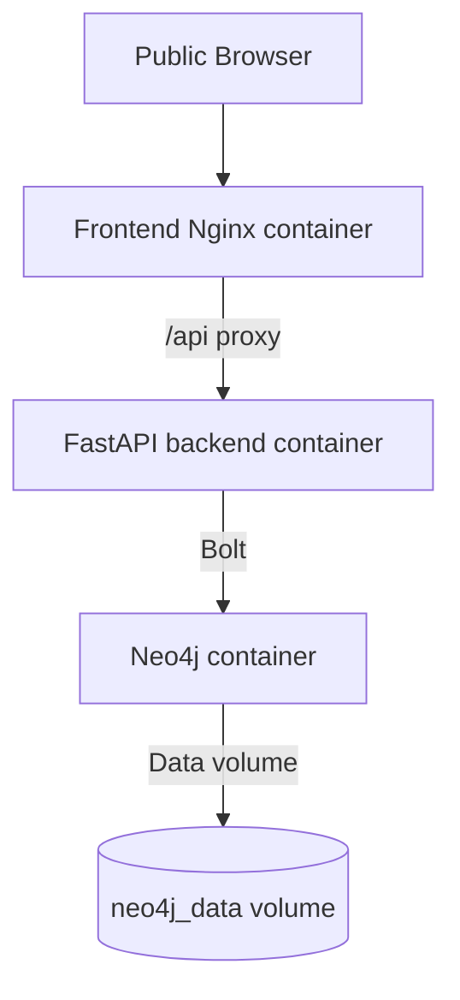
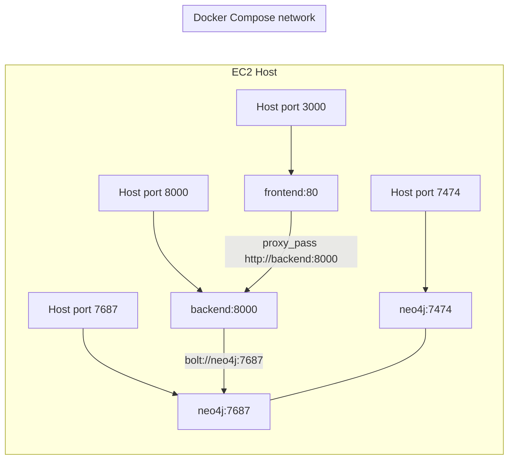

# Phase 3 Readiness Audit

## 1. Current Deployment Architecture Diagram

Current intended request flow:
- The frontend is built by `frontend/Dockerfile` into a static Vite bundle and served by Nginx.
- The frontend Nginx in `frontend/nginx.conf` serves the SPA from `/usr/share/nginx/html`.
- Browser API traffic goes to `/api/...`, then Nginx proxies it to `backend:8000`.
- The backend is started by Uvicorn in `backend/Dockerfile` and serves FastAPI from `backend/app/main.py`.
- The backend connects to Neo4j through the Docker service name `neo4j`.

## 2. Docker Networking Diagram

## 3. Which Container Receives Public Traffic?

- Intended public entry point: the frontend Nginx container.
- Current Compose reality: the backend and Neo4j are also host-published, so they are still externally reachable unless the AWS security group blocks them.
- For the intended public architecture, only the frontend Nginx container should receive browser traffic.

## 4. Which Containers Are Private?

- Intended private containers: backend and Neo4j.
- Current Compose implementation: they are not fully private because `infrastructure/docker-compose.yml` still publishes `8000`, `7474`, and `7687`.
- In practice, they can be treated as private only if the host firewall or AWS security group prevents direct access.

## 5. Backend Access Path

- The backend is intended to be accessed through frontend Nginx because the frontend uses `API_BASE = '/api'` in `frontend/src/App.tsx`, and Nginx proxies `/api/` to `backend:8000`.
- The backend is still directly reachable on host port `8000` because Compose publishes it.
- So the proxy path is correct, but the backend is not isolated from direct access yet.

## 6. Frontend Nginx as the Future HTTPS Endpoint

- Yes, `frontend/nginx.conf` can become the HTTPS endpoint in Phase 3.
- It already owns the web server role: static SPA serving, deep-link fallback with `try_files`, and `/api` proxying.
- It already forwards the right proxy headers:
  - `Host`
  - `X-Real-IP`
  - `X-Forwarded-For`
  - `X-Forwarded-Proto`
  - `X-Forwarded-Host`
- Phase 3 only needs TLS listeners, certificate paths, and HTTP-to-HTTPS redirection.

## 7. Localhost Assumptions

- No localhost assumptions remain in the production HTTP path for the frontend proxy.
- `server_name` is now `_` in `frontend/nginx.conf`.
- The frontend proxies to `backend:8000`, not localhost.
- The backend Neo4j URI in Compose uses `bolt://neo4j:7687`, not localhost.
- Localhost examples still exist in docs and non-runtime defaults:
  - `backend/app/core/config.py` still defaults `host` to `127.0.0.1`.
  - `backend/.env.example` still contains localhost placeholders for PostgreSQL, Redis, and RabbitMQ.
  - `backend/.env` still contains localhost placeholders for those optional services.
  - `README.md` still references localhost development URLs.

## 8. Proxy Headers

The current proxy block in `frontend/nginx.conf` is correct for production use behind a reverse proxy layer:

- `proxy_set_header Host $host;`
- `proxy_set_header X-Real-IP $remote_addr;`
- `proxy_set_header X-Forwarded-For $proxy_add_x_forwarded_for;`
- `proxy_set_header X-Forwarded-Proto $scheme;`
- `proxy_set_header X-Forwarded-Host $host;`

That is sufficient for preserving request identity and upstream awareness.

## 9. Let's Encrypt Integration Blockers

Nothing in the current repo prevents HTTPS conceptually, but several pieces are still missing for a successful Let's Encrypt setup:

- No `listen 443 ssl` block yet.
- No certificate paths or mounted certificate files.
- No HTTP-to-HTTPS redirect.
- No ACME challenge handling or webroot/standalone integration.
- `server_name _` is still a placeholder and must be changed to the final domain.
- Compose still publishes backend and Neo4j ports, which should not be public for the HTTPS release.

So Phase 3 is feasible, but Let's Encrypt is not wired in yet.

## 10. Remaining Production Issues Before Public Release

- Backend, Neo4j, and the app ports are still host-published in `infrastructure/docker-compose.yml`.
- No HTTPS/TLS termination exists yet.
- No certificate issuance or renewal workflow exists yet.
- `server_name` is still a catch-all placeholder, not the final domain.
- `backend/app/core/config.py` still defaults `host` to `127.0.0.1`, which is fine for development but inconsistent with production conventions.
- `backend/.env.example` and `backend/.env` still contain localhost placeholders for the unused optional services.
- Neo4j still uses a default password in Compose, which is not appropriate for a public release.
- Documentation still contains localhost-oriented instructions and examples.
- No production secrets-management mechanism exists yet.
- Public release hardening is limited to current Nginx headers, caching, and the Compose healthchecks.

## Final Recommendation

The Phase 2.2 Nginx work is structurally correct and ready to be extended into HTTPS.
The application path is already compatible with a single public frontend Nginx endpoint, but the stack is not yet public-release ready because Compose still exposes backend and Neo4j directly and there is no TLS/certificate workflow.

Recommended Phase 3 architecture:
- Public traffic enters only through frontend Nginx.
- Frontend Nginx terminates HTTPS.
- Backend remains private on the Compose network.
- Neo4j remains private on the Compose network.
- Docker Compose ports for backend and Neo4j should be removed or restricted before public launch.
